# Comprehensive ER and Enhanced ER (EER) Diagrams
## Supply Chain, Warehousing & Fleet Management System
**Course:** Database Management Systems (DBMS) Laboratory  
**Architecture:** Relational Physical Model & Conceptual EER Specialization Model  

---

## 1. Enhanced Entity-Relationship (EER) Conceptual Model

The Enhanced ER (EER) model extends classic ER modeling with advanced conceptual constructs: **Generalization/Specialization (ISA hierarchies)**, **Attribute Inheritance**, **Weak Entities**, **Multivalued Attributes**, and **Recursive Relationships**.

```mermaid
classDiagram
    direction TB

    %% Superclass PRODUCT and Subclasses
    class PRODUCT {
        <<Entity - Superclass>>
        +String PRODUCTID [PK]
        +String PNAME
        +String CATEGORY
        +Decimal UNITPRICE
    }
    class PERISHABLE_PRODUCT {
        <<Specialization - Subclass>>
        +Integer SHELFLIFEDAYS
        +String STORAGETEMPC
    }
    class HAZARDOUS_PRODUCT {
        <<Specialization - Subclass>>
        +String HAZARDCLASS
        +String HANDLINGNOTE
    }
    PRODUCT <|-- PERISHABLE_PRODUCT : {d, t} Disjoint
    PRODUCT <|-- HAZARDOUS_PRODUCT : {d, t} Disjoint

    %% Superclass EMPLOYEE and Subclasses
    class EMPLOYEE {
        <<Entity - Superclass>>
        +String EMPID [PK]
        +String ENAME
        +String ROLE
        +Decimal SALARY
        +String WAREHOUSEID [FK]
        +String SUPERVISORID [FK - Recursive]
    }
    class MANAGER {
        <<Specialization - Subclass>>
        +String LEVELNO
        +Decimal BONUS
    }
    class DRIVER {
        <<Specialization - Subclass>>
        +String LICENSENO
        +Date EXPIRY
    }
    EMPLOYEE <|-- MANAGER : {d} Disjoint
    EMPLOYEE <|-- DRIVER : {d} Disjoint
    EMPLOYEE --> EMPLOYEE : "1:N Supervises (Recursive)"

    %% Superclass GOODS_MOVEMENT and Subclasses
    class GOODS_MOVEMENT {
        <<Entity - Superclass>>
        +String MOVEMENTID [PK]
        +String ORDERID [FK]
        +String WAREHOUSEID [FK]
        +Date MOVEDATE
        +String STATUS
    }
    class SHIPMENT {
        <<Specialization - Subclass>>
        +Date DELIVERYDATE
    }
    class GOODS_RETURN {
        <<Specialization - Subclass>>
        +String REASON
        +Decimal REFUNDAMT
    }
    GOODS_MOVEMENT <|-- SHIPMENT : {d} Disjoint
    GOODS_MOVEMENT <|-- GOODS_RETURN : {d} Disjoint

    %% Multivalued Attributes represented as normalized associative entities
    class SUPPLIER_PHONE {
        <<Multivalued Attribute>>
        +String SUPPLIERID [PK, FK]
        +String PHONE [PK]
    }
    class DRIVER_CITY {
        <<Multivalued Route>>
        +String DRIVERID [PK, FK]
        +String CITY [PK, FK]
    }

    %% Core Relational Entities
    class SUPPLIER {
        <<Entity>>
        +String SUPPLIERID [PK]
        +String SNAME
        +String CITY [FK]
    }
    class WAREHOUSE {
        <<Entity>>
        +String WAREHOUSEID [PK]
        +String WNAME
        +String CITY [FK]
        +Integer CAPACITY
        +String MANAGERID [FK]
    }
    class CUSTOMER {
        <<Entity>>
        +String CUSTID [PK]
        +String CNAME
        +String STREET
        +String CITY [FK]
        +String PHONE
    }
    class ORDERS {
        <<Entity>>
        +String ORDERID [PK]
        +Date ORDERDATE
        +String STATUS
        +String CUSTID [FK]
    }
    class ORDER_ITEM {
        <<Weak Entity>>
        +String ORDERID [PK, FK]
        +String PRODUCTID [PK, FK]
        +Integer QTY
        +Decimal PRICE
    }
    class CITY {
        <<Entity - Domain>>
        +String CITY [PK]
        +String STATE
    }

    %% Relationships
    SUPPLIER "1" -- "*" SUPPLIER_PHONE : "Has Phones"
    SUPPLIER "1" -- "*" PRODUCT : "SUPPLIES (LeadTimeDays)"
    SUPPLIER "1" -- "*" CITY : "Located in"
    WAREHOUSE "1" -- "*" CITY : "Located in"
    WAREHOUSE "1" -- "*" PRODUCT : "STOCKS (Quantity)"
    WAREHOUSE "1" -- "1" MANAGER : "Managed by"
    CUSTOMER "1" -- "*" ORDERS : "1:N Places"
    CUSTOMER "1" -- "1" CITY : "Resides in"
    ORDERS "1" -- "*" ORDER_ITEM : "1:N Identifying Composition"
    ORDER_ITEM "*" -- "1" PRODUCT : "Includes"
    ORDERS "1" -- "*" GOODS_MOVEMENT : "1:N Initiates"
    ORDERS "*" -- "*" DRIVER : "Assigned via ORDER_DRIVER & DELIVERY_DUTY"
    DRIVER "1" -- "*" DRIVER_CITY : "Authorized Routes"
```

---

## 2. Relational Physical ER Diagram (All 22 Tables & Foreign Keys)

The physical relational schema implements normalization (up to 3NF/BCNF) and referential integrity constraints across all 22 database tables:

```mermaid
erDiagram
    CITY ||--o{ SUPPLIER : "located_in"
    CITY ||--o{ CUSTOMER : "resides_in"
    CITY ||--o{ WAREHOUSE : "located_in"
    CITY ||--o{ DRIVER_CITY : "transit_route"
    CITY ||--o{ DELIVERY_DUTY : "delivery_city"

    SUPPLIER ||--|{ SUPPLIER_PHONE : "has"
    SUPPLIER ||--o{ SUPPLIES : "supplies"
    SUPPLIER ||--o{ INSPECTION : "inspected"

    PRODUCT ||--o{ SUPPLIES : "supplied_by"
    PRODUCT ||--o{ INSPECTION : "tested_in"
    PRODUCT ||--o{ STOCK : "stored_in"
    PRODUCT ||--o| PERISHABLE_PRODUCT : "specializes"
    PRODUCT ||--o| HAZARDOUS_PRODUCT : "specializes"
    PRODUCT ||--o{ ORDER_ITEM : "ordered_in"

    WAREHOUSE ||--o{ STOCK : "holds"
    WAREHOUSE ||--o{ EMPLOYEE : "employs"
    WAREHOUSE ||--o{ GOODS_MOVEMENT : "originates"
    WAREHOUSE ||--o| MANAGER : "managed_by"

    EMPLOYEE ||--o| MANAGER : "is_a"
    EMPLOYEE ||--o| DRIVER : "is_a"
    EMPLOYEE ||--o{ EMPLOYEE : "supervises"

    DRIVER ||--o{ DRIVER_CITY : "covers"
    DRIVER ||--o{ ORDER_DRIVER : "assigned"
    DRIVER ||--o{ DELIVERY_DUTY : "delivers"

    CUSTOMER ||--o{ ORDERS : "places"

    ORDERS ||--|{ ORDER_ITEM : "contains"
    ORDERS ||--o{ ORDER_DRIVER : "dispatched_to"
    ORDERS ||--o{ DELIVERY_DUTY : "routed"
    ORDERS ||--o{ GOODS_MOVEMENT : "triggers"

    GOODS_MOVEMENT ||--o| SHIPMENT : "completes_as"
    GOODS_MOVEMENT ||--o| GOODS_RETURN : "reverses_as"

    CITY {
        VARCHAR2_50 CITY PK
        VARCHAR2_50 STATE
    }

    SUPPLIER {
        VARCHAR2_10 SUPPLIERID PK
        VARCHAR2_100 SNAME
        VARCHAR2_50 CITY FK
    }

    SUPPLIER_PHONE {
        VARCHAR2_10 SUPPLIERID PK,FK
        VARCHAR2_20 PHONE PK
    }

    PRODUCT {
        VARCHAR2_10 PRODUCTID PK
        VARCHAR2_100 PNAME
        VARCHAR2_50 CATEGORY
        NUMBER_10_2 UNITPRICE
    }

    PERISHABLE_PRODUCT {
        VARCHAR2_10 PRODUCTID PK,FK
        NUMBER_5 SHELFLIFEDAYS
        VARCHAR2_50 STORAGETEMPC
    }

    HAZARDOUS_PRODUCT {
        VARCHAR2_10 PRODUCTID PK,FK
        VARCHAR2_100 HAZARDCLASS
        VARCHAR2_200 HANDLINGNOTE
    }

    SUPPLIES {
        VARCHAR2_10 SUPPLIERID PK,FK
        VARCHAR2_10 PRODUCTID PK,FK
        NUMBER_5 LEADTIMEDAYS
    }

    INSPECTION {
        VARCHAR2_10 INSPID PK
        VARCHAR2_10 SUPPLIERID FK
        VARCHAR2_10 PRODUCTID FK
        DATE INSPDATE
        VARCHAR2_50 RESULT
    }

    WAREHOUSE {
        VARCHAR2_10 WAREHOUSEID PK
        VARCHAR2_100 WNAME
        VARCHAR2_50 CITY FK
        NUMBER_10 CAPACITY
        VARCHAR2_10 MANAGERID FK
    }

    STOCK {
        VARCHAR2_10 WAREHOUSEID PK,FK
        VARCHAR2_10 PRODUCTID PK,FK
        NUMBER_10 QUANTITY
    }

    EMPLOYEE {
        VARCHAR2_10 EMPID PK
        VARCHAR2_100 ENAME
        VARCHAR2_50 ROLE
        NUMBER_12_2 SALARY
        VARCHAR2_10 WAREHOUSEID FK
        VARCHAR2_10 SUPERVISORID FK
    }

    MANAGER {
        VARCHAR2_10 EMPID PK,FK
        VARCHAR2_50 LEVELNO
        NUMBER_10_2 BONUS
    }

    DRIVER {
        VARCHAR2_10 EMPID PK,FK
        VARCHAR2_50 LICENSENO
        DATE EXPIRY
    }

    DRIVER_CITY {
        VARCHAR2_10 DRIVERID PK,FK
        VARCHAR2_50 CITY PK,FK
    }

    CUSTOMER {
        VARCHAR2_10 CUSTID PK
        VARCHAR2_100 CNAME
        VARCHAR2_100 STREET
        VARCHAR2_50 CITY FK
        VARCHAR2_20 PHONE
    }

    ORDERS {
        VARCHAR2_10 ORDERID PK
        DATE ORDERDATE
        VARCHAR2_30 STATUS
        VARCHAR2_10 CUSTID FK
    }

    ORDER_ITEM {
        VARCHAR2_10 ORDERID PK,FK
        VARCHAR2_10 PRODUCTID PK,FK
        NUMBER_10 QTY
        NUMBER_10_2 PRICE
    }

    ORDER_DRIVER {
        VARCHAR2_10 ORDERID PK,FK
        VARCHAR2_10 DRIVERID PK,FK
    }

    DELIVERY_DUTY {
        VARCHAR2_10 ORDERID PK,FK
        VARCHAR2_10 DRIVERID FK
        VARCHAR2_50 CITY PK,FK
    }

    GOODS_MOVEMENT {
        VARCHAR2_10 MOVEMENTID PK
        VARCHAR2_10 ORDERID FK
        VARCHAR2_10 WAREHOUSEID FK
        DATE MOVEDATE
        VARCHAR2_30 STATUS
    }

    SHIPMENT {
        VARCHAR2_10 MOVEMENTID PK,FK
        DATE DELIVERYDATE
    }

    GOODS_RETURN {
        VARCHAR2_10 MOVEMENTID PK,FK
        VARCHAR2_200 REASON
        NUMBER_10_2 REFUNDAMT
    }
```



---

## 3. Structural Characteristics & Constraints

### 1. Generalization / Specialization Hierarchies
- **PRODUCT Hierarchy**:
  - Superclass: `PRODUCT`
  - Subclasses: `PERISHABLE_PRODUCT`, `HAZARDOUS_PRODUCT`
  - Constraint: **Total/Partial, Disjoint/Overlapping**. A product can specialize as perishable (shelf life, temperature constraints) or hazardous (handling notes, hazardous class).
  - Implementation: Primary keys of subclass tables reference the superclass primary key (`ON DELETE CASCADE`).

- **EMPLOYEE Hierarchy**:
  - Superclass: `EMPLOYEE`
  - Subclasses: `MANAGER`, `DRIVER`
  - Constraint: **Disjoint Specialization** ($d$). An employee is either a general staff member, a licensed driver, or an executive manager.

- **GOODS_MOVEMENT Hierarchy**:
  - Superclass: `GOODS_MOVEMENT`
  - Subclasses: `SHIPMENT`, `GOODS_RETURN`
  - Constraint: **Disjoint Specialization** ($d$). A goods movement either successfully delivers as a `SHIPMENT` or reverses as a `GOODS_RETURN`.

### 2. Weak Entity Sets & Identifying Relationships
- **`ORDER_ITEM`**:
  - Depends existence-wise on `ORDERS`.
  - Primary Key: Composite (`ORDERID` + `PRODUCTID`).
  - Cannot exist without the owner `ORDERS` tuple.

### 3. Multivalued Attributes
- **`SUPPLIER_PHONE`**: Normalized 1NF decomposition of multiple contact numbers for a single supplier.
- **`DRIVER_CITY`**: Normalized representation of multiple transit cities authorized for a driver.

### 4. Recursive Self-Referencing Relationship
- **`EMPLOYEE.SUPERVISORID` $\rightarrow$ `EMPLOYEE.EMPID`**: Models internal organizational hierarchy where managers supervise subordinates.
